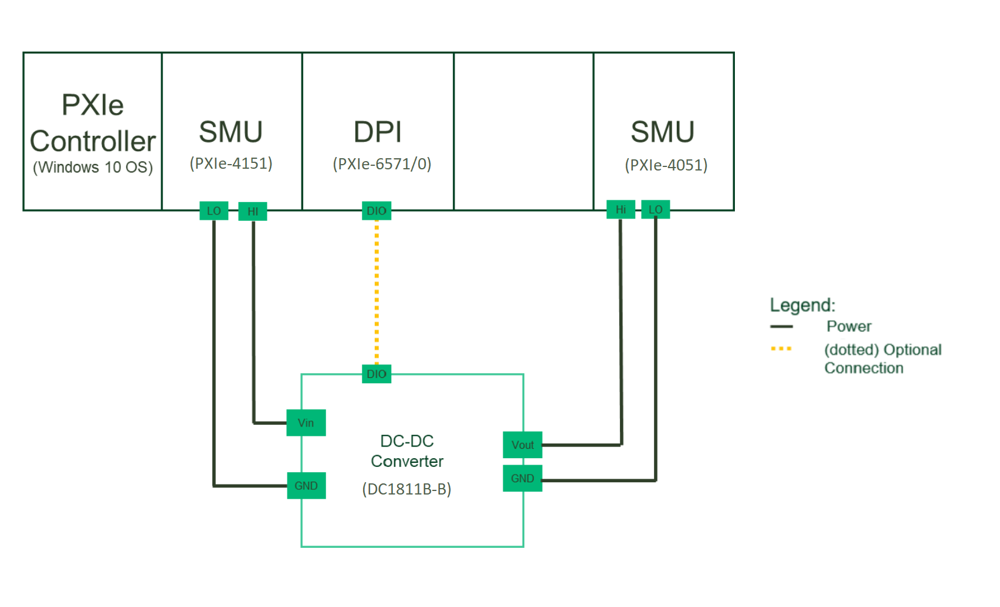

# pmic-python

 These MeasurementLink Python plugins makes measurements for Power Management IC's.
 
 The tests supplies power to the DUT and sinks power from the DUT and validates the specifications of the DUT by performing measurements.

## Key Features

 - Single channel measurements
   - Ripple
   - Output Voltage Accuracy

Click here for a detailed list of measurements and their functionality: [Measurement List](docs/measurements/meas-index.md)

## Hardware Setup

Instrumentation:
- NI Programmable Power Supply (NI 4151)
- NI Electronic Load (NI 4051)
- Digital Pattern Instrument (NI 6570/1) (note: the software does not include DPI or its dependencies, but it may be required to communicate with the DUT)

Tested hardware setup:
- NI 4151
- NI 4051
- NI 6570/1

## Software Dependencies
(*This section is applicable if you only want to use the pre-compiled plug-ins. If you want to open the source code, go to [software development](docs/sw-dev.md).*)  
Install from NI Package Manager:

- InstrumentStudio (2024 Q1 or higher)
- Measurement Link (2024 Q1 or higher)
- NI-DCPower (2023 Q4 or higher)
- NI SDC Add-On (2023 Q4 or higher) (note: only if using DPI for DUT communication)