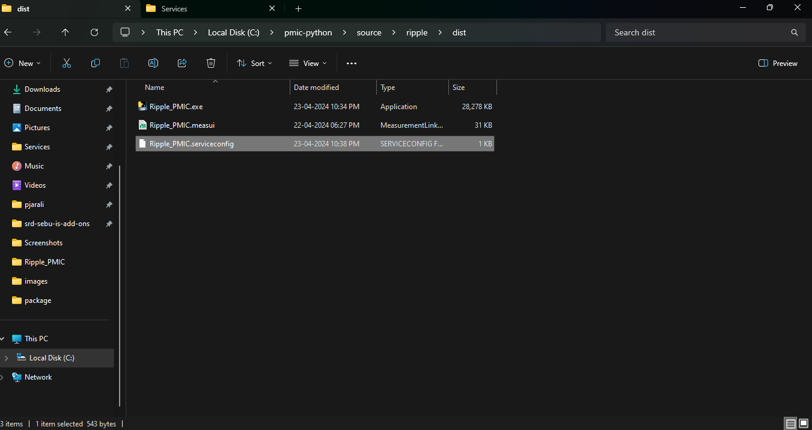

## Build EXE for each measurement

#### [GitHub explanation](https://github.com/ni/measurementlink-python?tab=readme-ov-file#create-executable-for-python-scripts)

1. Install [pyinstaller](https://pyinstaller.org/en/stable/) using command 'pip install -U pyinstaller' in command prompt.
      
   

2. Open command prompt in working directory and run command 'pyinstaller --onefile --console --paths .venv\Lib\site-packages measurement.py'.

   

3. After successful execution of command build and dist folders will be formed in working directory

   

4. measurement.exe will be present in dist folder.

5. Add service-config, start.bat and UI files in dist folder.

   

Note: Please note that the /build and /dist folder must not be committed to repo and will be ignored by .gitignore upon commit.