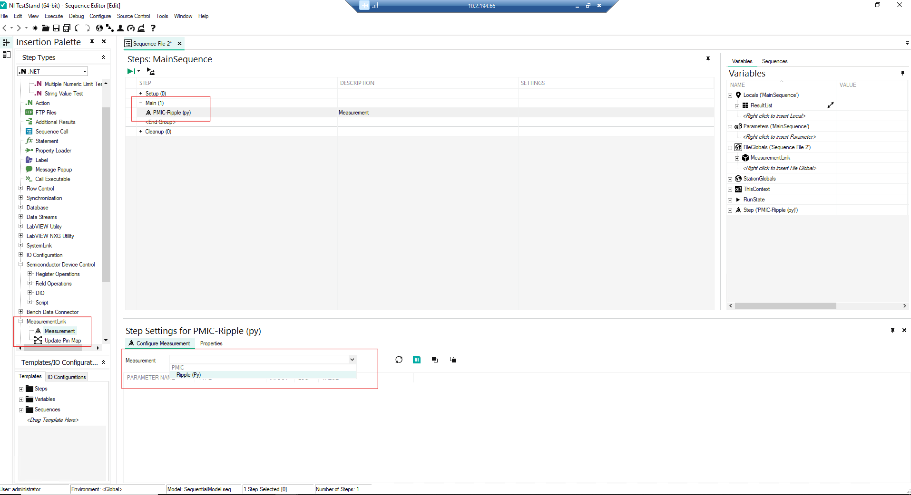
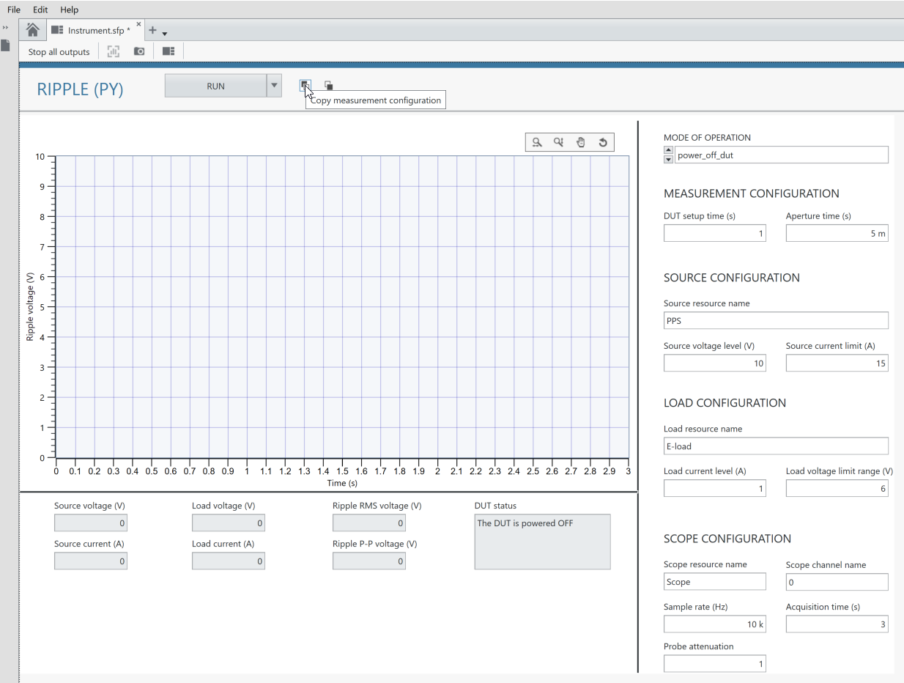
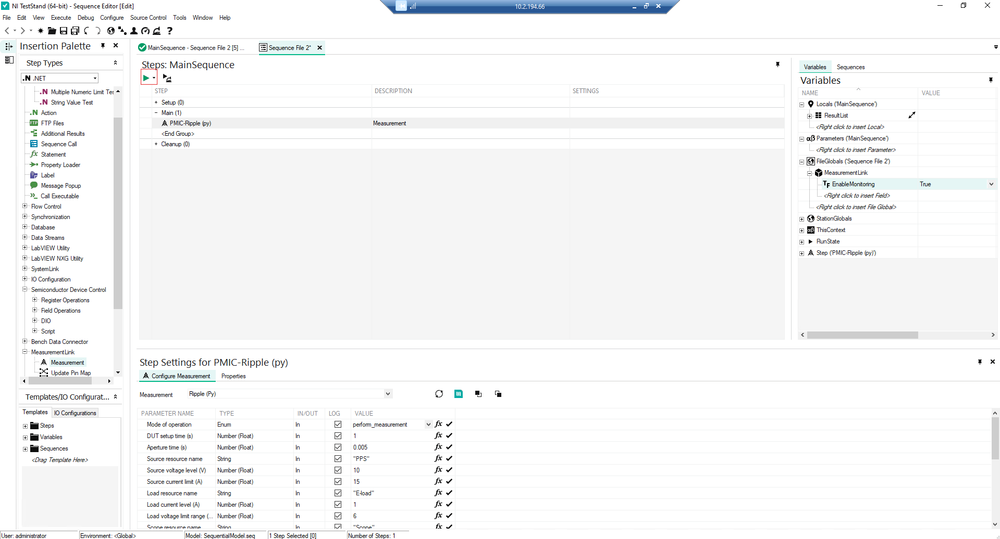
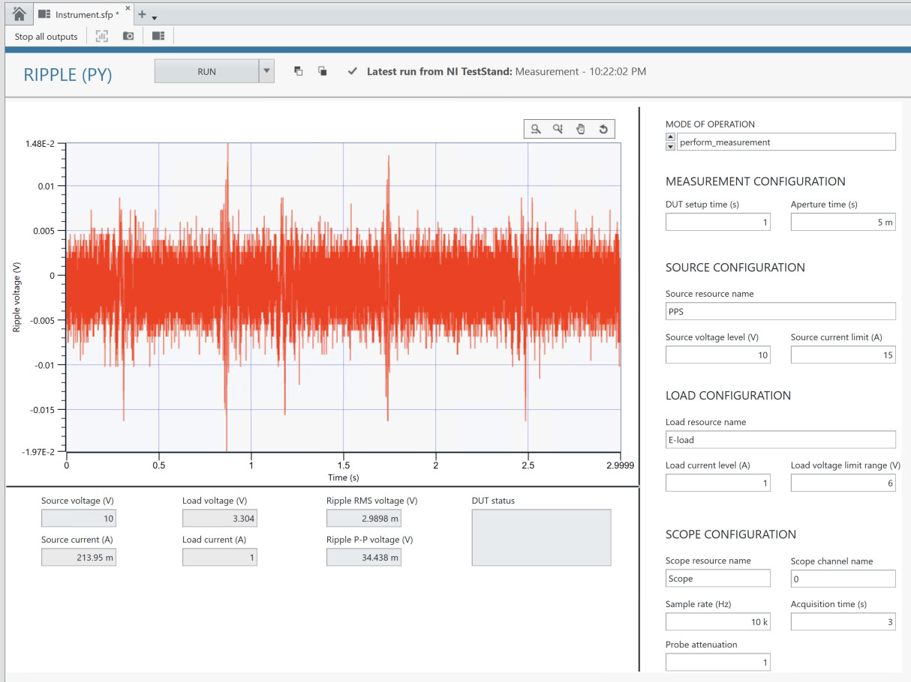

# Getting Started

## Workflow
This workflow is applicable for all the PMIC measurements.

### Adding a measurement panel to InstrumentStudio

1. Open InstrumentStudio
   

2. Click Manual Layout, and select required measurement under the collection (for e.g., Ripple (Py) under PMIC) and 'Create Large Panel' from dropdown. Click OK.
   

3. Ripple measurement UI will get displayed on a large panel as shown in below screenshot.
   

### Powering ON

1. Select "power_on_dut" option from the 'Mode Of Operation' dropdown. Give appropriate values to controls in Source configuration to which DUT is connected and run the measurement service with the default values.
   #### Note: - Values of other than source resource name, voltage level and current limit controls doesn't affect the power_on_dut mode of operation

   

2. The status message will be shown in DUT status indicator if there is no error. 
   
   

### Communication with the DUT (if needed)

1. Now that the DUT is powered ON, configure the DUT settings either by using SDC panel or from the native GUI of the DUT.

   

### Perform Measurement

1. As the communication is established with the DUT, now select "perform_measurement" option from the 'Mode of Operation' dropdown. Give appropriate resource names the DUT is connected to and run the measurement service with the default values.
   
   

### Powering OFF

1. After performing the measurements, make sure to Power off the DUT by selecting the power_off_dut option from 'Mode Of Operation' dropdown. 
   #### Note: - Apart from resource names, values of other controls doesn't affect the power_off_dut mode of operation

   

2. The status message will be shown in DUT Status indicator if there is no error. 
   
   

## Parameters in the UI

Please refer to [this](measurements/common/parameters-def.md) document for more detailed information on the controls/indicators used.

## Adding a  measurement step to TestStand 

Follow the workflow below to automate the measurements using TestStand and monitor it from Instrument Studio.

After adding measurement service into the Instrument Studio as explained above,

1. Open TestStand 2022 Q4 or higher version. Open a new sequence file and save the file. 

   

2. Insert a 'Measurement' step under MeasurementLink in Insertion palette or by selecting Insert Step > MeasurementLink > Measurement in right click menu.
   Rename the step as required and choose the required measurement in Step settings.

   

3. To transfer the measurement configuration from the Instrument Studio to the TestStand, click on "COPY button" highlighted in the screenshot.

   

4. The below indication confirms the Measurement configuration is copied

   

5. Select the measurement step and click on the paste button as highlighted in the screenshot. There will be a message indicating that the measurement configuration is applied.

   

6. Set 'Enable Monitoring' variable to True as shown in below screenshot. It will help us to monitor the results in Instr Studio.

   

7. Save the Sequence file and RUN the sequence. While running the sequence file in TestStand you can see measurement results and graphs updated in the InstrumentStudio as well.

   

8. The measurement results are updated in the Instrument Studio as below.

   

9. In TestStand, the measurment test status will be 'Done' if there is no error.

    

10. The same workflow of Power on the DUT, Perform Measurement, and Power off the DUT can be followed in TestStand, by adding three Measurement Steps along with the SDC steps. Make sure to Power off the DUT. 

   

Please refer [this](measurements/meas-index.md) for more details on each measurement.
