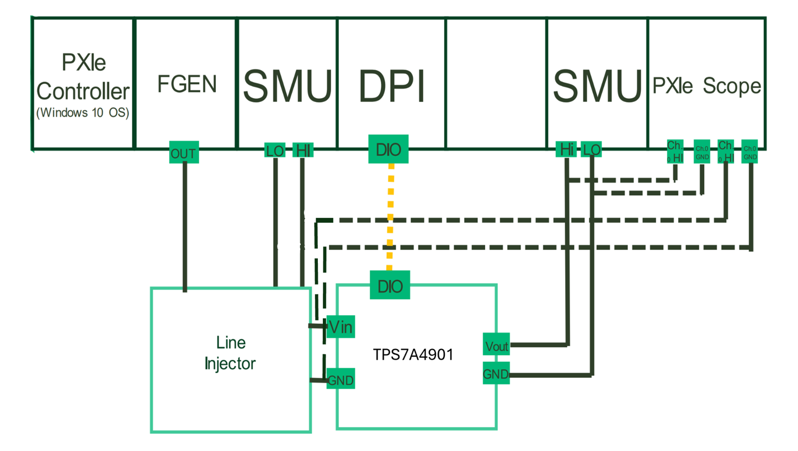
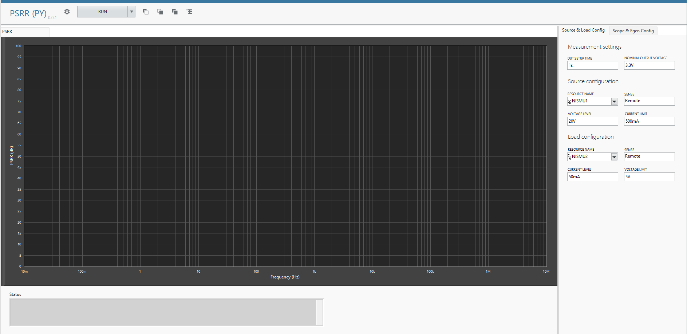
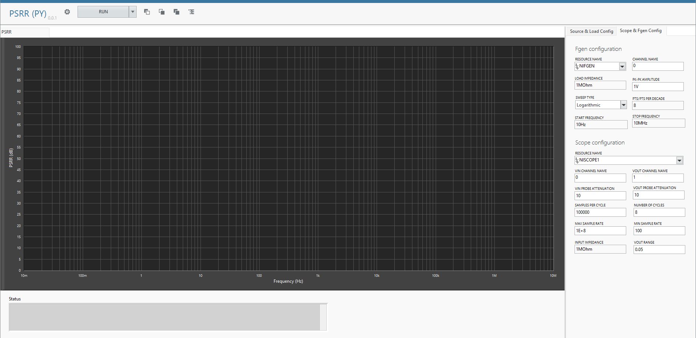
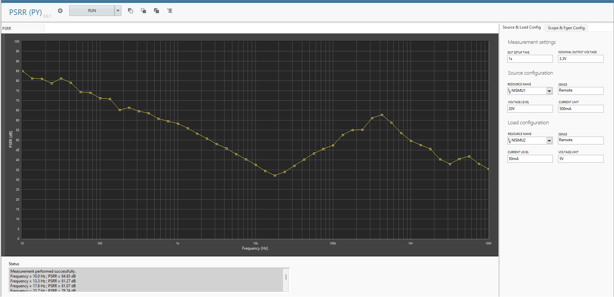
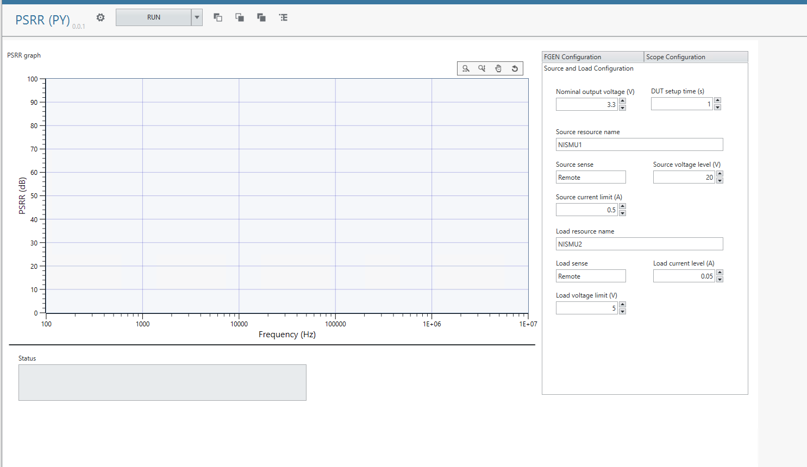
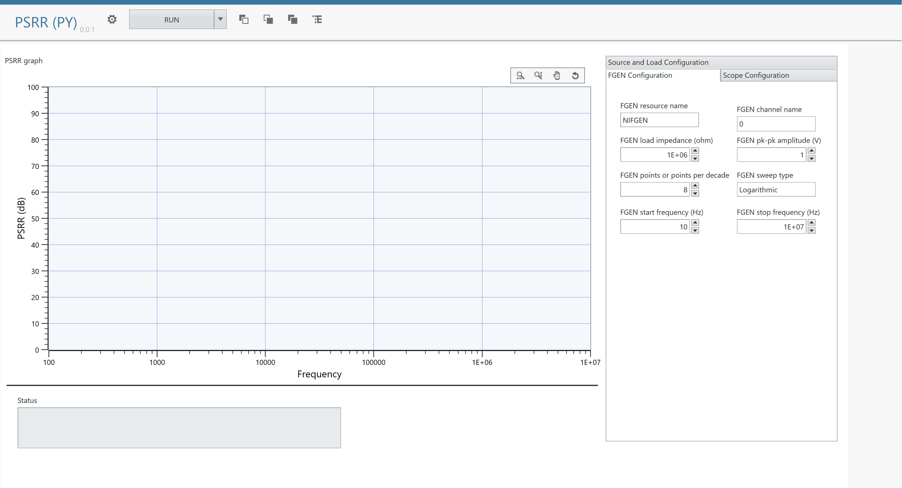
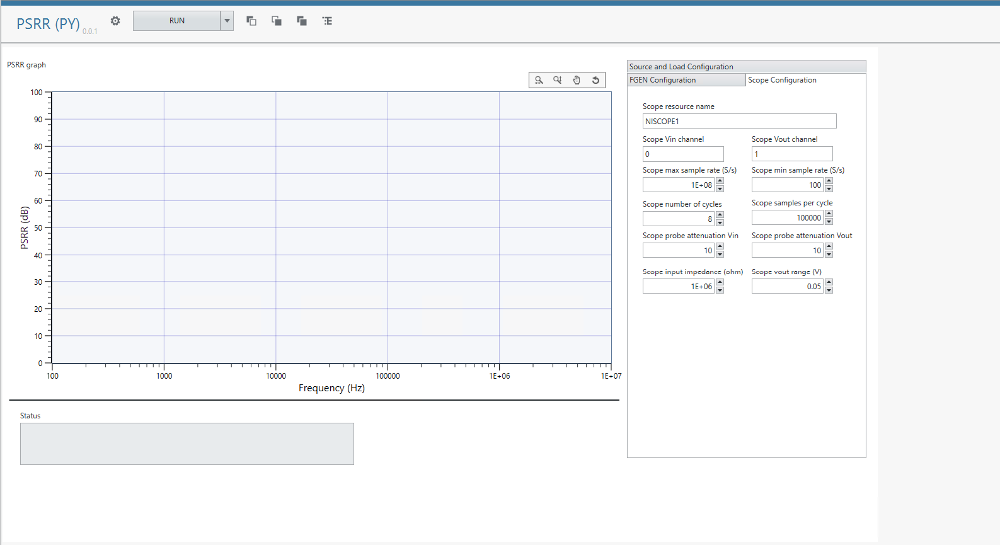
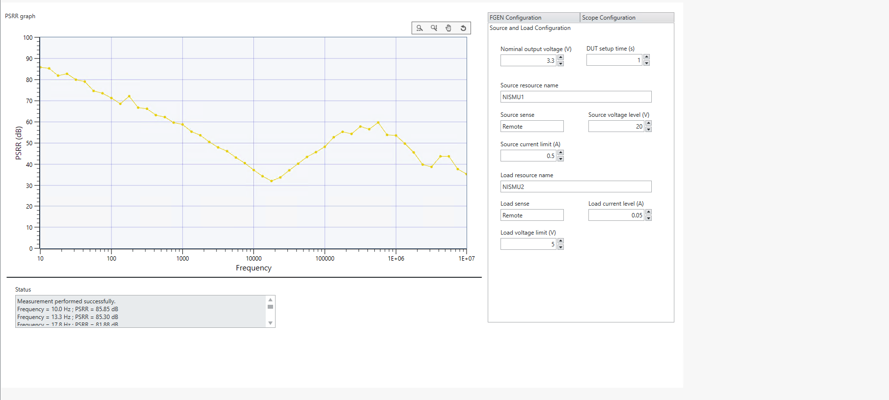

# PSRR
This service performs PSRR measurement for PMIC.

## Hardware Setup
   

## InstrumentStudio Panel

### Note:
By default, the application uses the LabVIEW GUI. If you want to switch to the Measurement UI Editor GUI, update the file name in measurement.py by modifying the ui_file_paths parameter as shown below: **ui_file_paths=[service_directory / "PSRR_PMIC.vi"]**

### Usage with LabVIEW GUI

1. Select the appropriate source, load, scope and Fgen resource names and update other parameters as needed.
   Source and load Configuration
   
   Fgen and Scope Configuration
   

2. Run the measurement. PSRR graphs should be visible without any error.

   PSRR:
   

### Usage with Measurement UI Editor GUI
1. Select the appropriate source, load, scope and Fgen resource names and update other parameters as needed.
   Source and load Configuration
   
   Fgen Configuration
   
   Scope Configuration
   

 2. Run the measurement. PSRR graphs should be visible without any error.

    PSRR:
   

