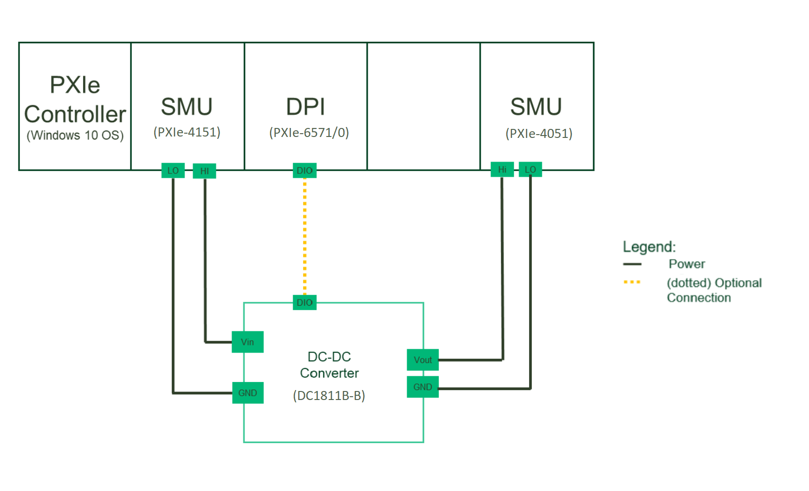
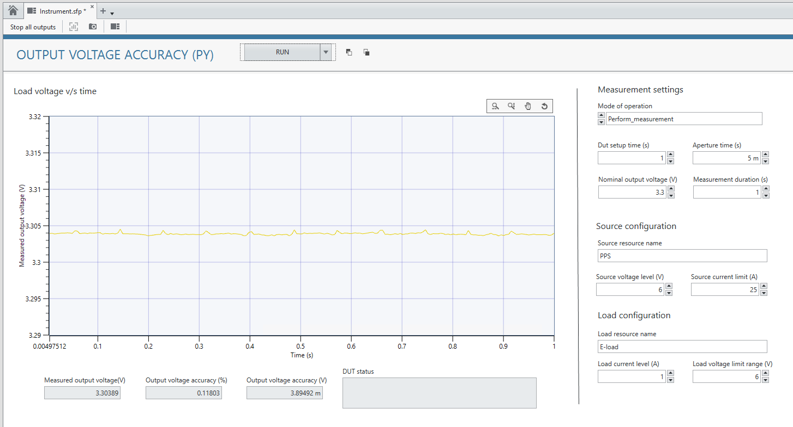

# Output Voltage Accuracy
This service performs Output Voltage Accuracy measurements.

## Hardware Setup

## InstrumentStudio Panel

### Usage

1. Select the appropriate source and load resource names and update other parameters as needed. Please note that, the measurement is in 'Perform measurement' mode of operation by default.

   

2. Run the measurement. The measured output voltage can be seen from the graph.The calculated output voltage accuracy (% and V) are displayed in the panel below.
   
   